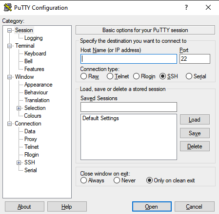

# TROUBLESHOOTING TIPS FOR OMIS

## SOFTWARE NEEDED
- PUTTY



### CONNECT TO OMIS SERVER
#### COPY FOLLOWING INTO HOST NAME TEXT BOX IN PUTTY
```
docker@omis.wpd.woodportdoors.com
```
- Any security dialogs concerning server's host key not cached can be accepted. (Click Yes)
- Upon connecting to server with putty, enter password (standard r password)

#### COMMANDS TO FOLLOW TO RESTART ALL OMIS SERVICES
```
dc restart
```

#### COMMANDS TO RESTART INDIVIDUAL SERVICES
- app - OMIS/Reporting Engine
- sir - Sanding Line
```
dc restart {service}
```
#### COMMANDS TO FOLLOW TO REBOOT OMIS SERVER
##### CONNECT USING PUTTY LIKE ABOVE
```
sudo reboot
```
